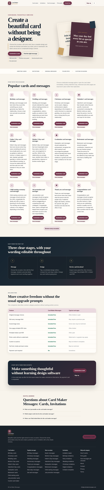

# Card Maker Messages

A premium, mobile-first card maker, invitation maker and original message library for **cardmakermessages.com**. Visitors choose an occasion, edit every word, tap a complete design, review the result and then share, print or download it. The core design and export features run in the browser without a paid API or per-card cost.



## Launch configuration

The project is already configured with:

- **Brand:** Card Maker Messages
- **Domain:** https://cardmakermessages.com
- **Contact email:** info@cardmakermessages.com
- **Locale:** UK English

Do not change the IndexNow key after the website goes live.

## What is included

- Simple click-and-pick workflow with no drag-and-drop editor
- Greeting cards, invitations, postcards and completely custom occasions
- Birthday, Christmas, wedding, anniversary, Easter, Mother’s Day, Father’s Day, Valentine’s Day, graduation, retirement, child naming, job promotion and other occasions
- Original message choices organised by occasion, recipient and tone
- Every important line remains editable during **Message**, **Design** and **Review & Download**
- Ten complete one-tap design presets
- Equal-size front, inside-left, inside-right and back previews
- Light white or ivory folded-card interiors by default
- Full four-panel review before download
- Optional photo upload processed in the browser
- Digital and social image sizes for Instagram, WhatsApp, Facebook, LinkedIn, Pinterest and Stories
- One-page printable PDFs in A4, A5, A6, 5 × 7 inch and US Letter
- Folded PDFs for A4 to A5, A5 to A6 and US Letter
- Home-printer and professional-print settings
- Three free exports followed by free email sign-up, with no card details requested
- A sign-up control in the shared header on every page
- Mobile sticky card preview with the editing controls kept visible below it
- Autosave and resume on the same device
- Light and dark themes
- **50 generated HTML pages: 49 indexable pages plus a real 404**
- Unique page-specific FAQs, contextual internal links and topical hubs
- Article, FAQ, HowTo, WebApplication, Organization and breadcrumb schema
- Sitemap, robots.txt, IndexNow, AI answer-bot access, llms.txt and PWA files
- Original procedural visual motifs with no external templates, characters, logos or third-party artwork
- Security headers, cache rules and automated QA

## Copyright safety

The included card motifs and decorations are original procedural compositions created by the application. The project does not bundle third-party card templates, branded characters, logos, song lyrics, poems, stock-photo packs or copied quotations. Read `COPYRIGHT-SAFETY.md` before adding future content or artwork.

## Keyword architecture

Closely related keyword variants are grouped onto one strong page instead of creating thin duplicates. For example, “invitation maker”, “online invitation maker” and “free invitation maker” support the main invitation-maker page, while birthday, wedding, party and Christmas searches have separate pages where the search intent is genuinely different.

The site deliberately avoids unrelated or legally risky trading-card brands and stored-value gift-card terms.

## Build on Windows

1. Install Node.js if it is not already installed.
2. Double-click `build.bat`.
3. Confirm both messages appear:
   - `Built 50 HTML pages, 49 indexable URLs and shared assets.`
   - `QA passed ... assertions across 50 HTML pages.`
4. Commit or upload the complete folder.

You can also open Command Prompt in this folder and run:

```bash
npm run check
```

## Upload to GitHub

1. Extract the ZIP.
2. Open GitHub Desktop.
3. Choose **File > Add local repository**.
4. Select the extracted `card-maker-messages` folder.
5. Publish the repository or push it to an existing repository.

The ZIP contains a Git repository and a complete release commit.

## Deploy with Hostinger Git

1. Connect the GitHub repository in Hostinger.
2. Set the deployment branch to `main`.
3. Set the deployment path to `public_html` for the main domain.
4. Deploy the latest commit.
5. Create a private folder beside `public_html` named `cmm_private` and ensure PHP can write to it. The sign-up database is created there automatically.
6. Open `https://cardmakermessages.com/app.html` in a private browser window.
7. Test three exports, then confirm the fourth export opens the free sign-up form.
8. Submit `https://cardmakermessages.com/sitemap.xml` to Google Search Console and Bing Webmaster Tools.
9. After deployment, run:

```bash
node tools/submit-index.js
```

Google does not use IndexNow. Google uses the sitemap and URL Inspection.

## Folded-card printing

The folded PDF has two landscape pages:

- Page 1: back cover on the left, front cover on the right
- Page 2: inside-left panel on the left, main message on the right

For most home printers use landscape, Actual Size or 100%, double-sided printing and **flip on short edge**. Test with plain paper before using card stock.

## Source files

- Shared branding and generated page shell: `tools/build.js`
- Keyword landing pages: `src/tool-pages.json`
- Occasion message guides: `src/seo-pages.json`
- Message library: `src/messages.js`
- Card and invitation behaviour: `src/app.js`
- Premium visual system: `src/site.css`
- Sign-up endpoints: `api/subscribe.php` and `api/unsubscribe.php`

Never hand-edit generated HTML files at the repository root. Edit the source files and run the build again.
