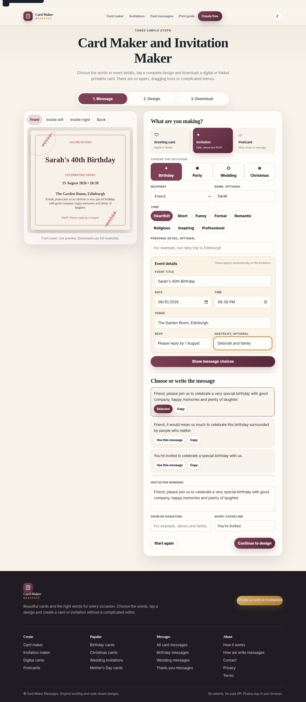

# Card Maker Messages

A premium, GitHub-ready card maker, invitation maker and original card-message library for **cardmakermessages.com**. The core app runs in the browser with no paid API and no per-card cost.



## Launch configuration

The project is already configured with:

- **Brand:** Card Maker Messages
- **Domain:** https://cardmakermessages.com
- **Contact email:** info@cardmakermessages.com
- **Locale:** UK English

Do not change the IndexNow key after the website goes live.

## What is included

- Click-and-pick card maker with no drag-and-drop complexity
- Greeting card, invitation and postcard creation modes
- Birthday, wedding, Christmas, party and other occasion options
- Event title, date, time, venue, host and RSVP fields for invitations
- Original card-message choices organised by occasion and tone
- Ten complete one-tap premium design presets
- Live front, inside-left, inside-right and back-cover preview
- Optional private photo upload processed only in the browser
- PNG and JPG exports in useful digital and social sizes
- Two-page folded PDF export for A4 and US Letter
- Home-printer and professional-print settings
- Autosave and resume on the same device
- Light and dark themes
- Mobile sticky preview and accessible tap targets
- **41 generated HTML pages: 40 indexable pages plus a real 404**
- 17 distinct keyword-focused card, invitation and template landing pages
- 13 occasion message guides
- Article, FAQ, HowTo, WebApplication, Organization and breadcrumb schema
- Sitemap, robots.txt, IndexNow, AI answer-bot access, llms.txt and PWA files
- Security headers, cache rules and automated QA

## Keyword architecture

Closely related keyword variants are grouped onto one strong page instead of creating thin duplicates. For example, “invitation maker”, “online invitation maker” and “free invitation maker” support the main invitation-maker page, while birthday, wedding, party and Christmas searches have their own intent-specific pages.

The site deliberately does not create pages for unrelated or legally risky terms such as trading-card brands or stored-value gift cards.

## Build on Windows

1. Install Node.js if it is not already installed.
2. Double-click `build.bat`.
3. Confirm both messages appear:
   - `Built 41 HTML pages, 40 indexable URLs and shared assets.`
   - `QA passed ... assertions across 41 HTML pages.`
4. Commit or upload the complete folder.

You can also open Command Prompt in this folder and run:

```bash
npm run check
```

## Upload to GitHub

1. Extract the ZIP.
2. Open GitHub Desktop.
3. Choose **File > Add local repository**.
4. Select the extracted `card-maker-messages` folder.
5. Publish the repository or push it to an existing repository.

The ZIP contains a Git repository and an initial commit.

## Deploy with Hostinger Git

1. Connect the GitHub repository in Hostinger.
2. Set the deployment branch to `main`.
3. Set the deployment path to `public_html` for the main domain.
4. Deploy the latest commit.
5. Open `https://cardmakermessages.com/app.html` in a private browser window.
6. Test a digital PNG and an A4 folded PDF.
7. Submit `https://cardmakermessages.com/sitemap.xml` to Google Search Console and Bing Webmaster Tools.
8. After deployment, run:

```bash
node tools/submit-index.js
```

Google does not use IndexNow. Google uses the sitemap and URL Inspection.

## Folded-card printing

The folded PDF has two landscape pages:

- Page 1: back cover on the left, front cover on the right
- Page 2: inside-left panel on the left, main message on the right

For most home printers use landscape, Actual Size or 100%, double-sided printing and **flip on short edge**. Test with plain paper before using card stock.

## Source files

- Shared branding and generated page shell: `tools/build.js`
- Keyword landing pages: `src/tool-pages.json`
- Occasion message guides: `src/seo-pages.json`
- Message library: `src/messages.js`
- Card and invitation behaviour: `src/app.js`
- Premium visual system: `src/site.css`

Never hand-edit generated HTML files at the repository root. Edit the source files and run the build again.
